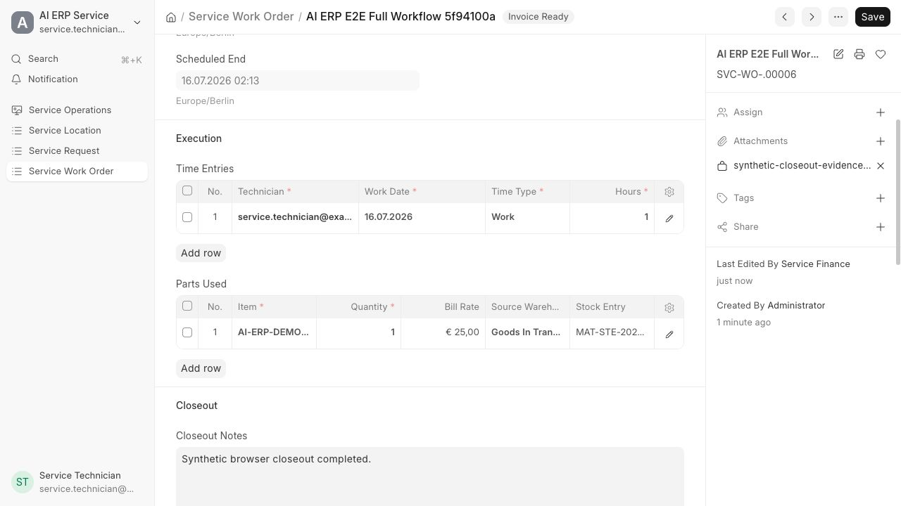
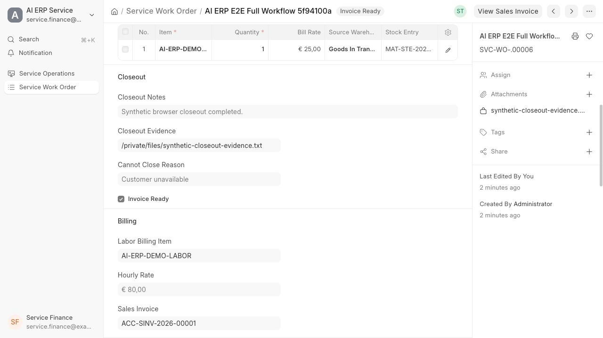
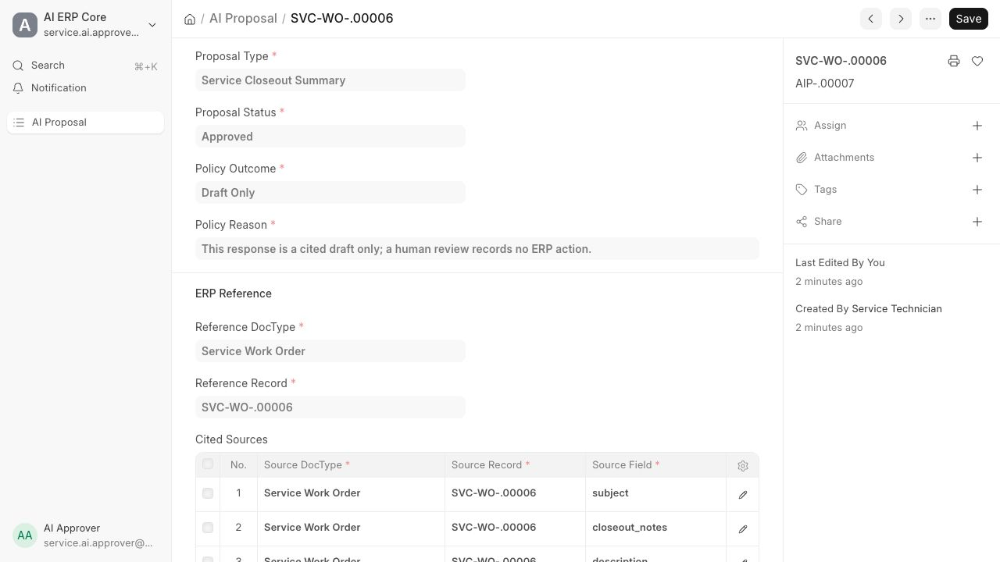

# AI ERP Demo

**Demo Version** `2026.07.30-demo` — private zero-cost local synthetic product
label (`config/demo-version.json`). Not a production release tag.

A governed, AI-assisted field-service ERP built as custom Frappe apps on top of
ERPNext. The product turns a customer service request into assigned technician
work, verified execution evidence, a margin-aware closeout, and exactly one
draft Sales Invoice, without ever letting AI post a business transaction.

The project currently ships as a private, zero-cost, local synthetic demo. It
runs entirely on one machine with a deterministic AI provider, so no cloud
account, hosted model, or billable credential is required to evaluate it.

Facilitator map of the end-to-end path:
[`docs/product/demo-version-loop.md`](docs/product/demo-version-loop.md).
What the stack actually runs:
[`docs/product/demo-version-stack.md`](docs/product/demo-version-stack.md).

## Why this exists

Field-service companies with 10 to 100 technicians lose money in the gap
between finished work and clean invoices: missing time, unbilled parts, silent
warranty risk, and closeouts nobody can verify later. Generic AI bolt-ons make
this worse by writing plausible text with no evidence trail. This project takes
the opposite position:

- Every AI output is a draft proposal with cited source records and a
  reviewer decision. It cannot change ERP state.
- Every business-state change is deterministic ERPNext code executed by an
  authorized human role.
- Every step from service request to draft invoice keeps an auditable link, so
  a manager can replay how the money position came to be.

## Product demonstration

The user interface is the standard Frappe Desk web UI extended with the
custom DocTypes, role-scoped forms, and report views below. Screenshots come
from the local synthetic site; a recorded walkthrough can be produced with the
script in `docs/runbooks/demo-script.md`.

Technician execution: time, declared parts, submitted stock link, and closeout
evidence stay on the permission-scoped work order.



Manager and finance handoff: the manager marks work invoice-ready and a
separately authorized Accounts user owns the linked draft Sales Invoice.



Governed AI draft: cited sources, human review, and a Draft Only policy are
visible on every AI proposal.



## Architecture

```text
                 +--------------------------------------+
                 |            Frappe / ERPNext          |
                 |  permissions, workflow, accounting,  |
                 |  stock, invoicing, background jobs   |
                 +-------------------+------------------+
                                     |
              +----------------------+---------------------+
              |                      |                      |
   +----------+---------+ +---------+----------+ +---------+---------+
   |    ai_erp_core     | |   ai_erp_service   | |  industry packs   |
   |  AI Proposal ledger| | service requests,  | |  distribution and |
   |  citations, review | | work orders, parts,| |  manufacturing as |
   |  audit metadata    | | closeout, invoices | |  configured demos |
   +----------+---------+ +--------------------+ +-------------------+
              |
              |  one versioned HTTP contract, bearer service key
              v
   +----------+----------------------------------+
   |          AI control plane (FastAPI)          |
   |  stateless, site-scoped, draft-only          |
   |  provider adapters, redaction, evaluation    |
   +----------+----------------------------------+
              |
              v
   template provider (deterministic, zero cost)
   or pinned hosted model over an approved
   regional endpoint with store disabled
```

Design boundaries that hold everywhere:

- ERPNext and Frappe are upstream dependencies pinned by commit; their source
  is never copied or patched in this repository.
- Custom behavior lives only in `apps/`. Cross-industry capability goes in
  `apps/ai_erp_core/`; the field-service vertical lives in
  `apps/ai_erp_service/`.
- All model-provider calls, prompt handling, redaction, and evaluation live in
  `services/ai_control_plane/`. The control plane has no ERP database
  credentials and no permission to post transactions.
- Every external API and business event is versioned under `contracts/`.
- Architecture decisions are recorded in `docs/adr/`; see ADR-0001 through
  ADR-0008 for the core platform, tenancy, AI boundary, control plane,
  licensing, provider, infrastructure, and browser-testing decisions.

## Repository layout

```text
.
├── apps/                        # Custom Frappe apps only
│   ├── ai_erp_core/             # Horizontal capabilities and shared policies
│   ├── ai_erp_service/          # First vertical: field service
│   ├── ai_erp_distribution/     # Reserved boundary; standard configured demo only
│   ├── ai_erp_manufacturing/    # Reserved boundary; standard configured demo only
│   └── ai_erp_connectors/       # External-system adapters
├── services/
│   └── ai_control_plane/        # Model gateway, redaction, evals, audit controls
├── contracts/
│   ├── openapi/                 # Versioned external API specifications
│   └── events/                  # Versioned business-event contracts
├── docs/
│   ├── adr/                     # Architecture decision records
│   ├── architecture/            # System context, boundaries, data model
│   ├── product/                 # Positioning, scope, scorecard targets
│   ├── security/                # Threat model and data classification
│   ├── runbooks/                # Demo, backup, recovery, incident guides
│   └── workflows/               # Repeatable engineering workflows
├── infra/
│   ├── compose/                 # Local development Docker Compose
│   ├── aws/terraform/           # Prepared production reference, no apply
│   └── observability/           # Dashboards, alerts, telemetry configuration
├── tests/
│   ├── contract/                # API and event compatibility tests
│   ├── e2e/                     # Pinned synthetic Playwright role/route smoke
│   ├── fixtures/                # Synthetic, non-customer test data
│   └── performance/             # Synthetic profile + rollback-only smoke runner
├── scripts/                     # Quality gates and developer automation
├── development/                 # Tracked bootstrap config; local bench is ignored
└── config/                      # Checked-in, environment-safe policy manifests
```

## Technology stack

Pin-accurate Demo Version facts (commits, digests, provider default) live in
[`docs/product/demo-version-stack.md`](docs/product/demo-version-stack.md).
Architecture rationale:
[`docs/architecture/tech-stack-2026-07.md`](docs/architecture/tech-stack-2026-07.md).

| Layer | Choice | Reason |
| --- | --- | --- |
| ERP core | ERPNext v16 on Frappe v16, pinned by commit | Mature open-source accounting, stock, permissions, and workflow engine |
| Custom apps | Python 3, Frappe app framework | Extends the ERP without forking upstream |
| AI control plane | Python 3.14, FastAPI, httpx, draft-only OpenAPI contract | Stateless typed boundary that fails closed |
| Data | MariaDB, Redis | Frappe-native persistence, cache, and queues |
| Contracts | OpenAPI 3.1, versioned event schemas | Compatibility is testable and reviewable |
| Browser tests | Playwright with a pinned Chromium | Role journeys are proven through the real UI |
| Local runtime | Docker Compose | One-command reproducible development stack |
| Production reference | Terraform for AWS ECS, prepared but never applied without approval | Infrastructure exists as reviewed code, not as a running liability |
| Lint and gates | ruff plus repository consistency checkers in `scripts/` | Documentation, configuration, and code cannot drift apart silently |

## Governance and safety model

The AI layer can retrieve, classify, summarize, draft, and propose. It cannot
create, submit, cancel, or amend any accounting, stock, payroll, permission,
compliance, or customer-message record. That rule is enforced three times:

1. Contract: the proposal response schema carries a policy block that is
   constant `draft_only` with allowed action `none`; unknown fields are
   rejected at both ends.
2. Ledger: every proposal is stored as an immutable AI Proposal record with
   cited sources, content hashes, and a required human review outcome. Only an
   authorized approver role can approve or reject, and approval itself changes
   no ERP transaction.
3. Runtime: the control plane holds no ERP credentials, and the ERP-side
   client validates provider identity, schema, citations, and hashes before
   persisting anything.

Role separation is tested, not assumed: technicians see only assigned work and
never see finance fields; managers own closeout and invoice-readiness; only an
Accounts role can draft the Sales Invoice; stock issues and draft invoices are
idempotent so retries cannot double-post.

## Quantitative safeguards

The safety claims reduce to checkable numbers.

Integrity and idempotency

- Every citation, model input context, model output, and provider response
  identifier is hashed with SHA-256; hashes are stored instead of raw content.
- The idempotency key for a proposal is the triple of reference doctype,
  reference name, and input-context hash computed over canonical JSON, so an
  identical retry returns the existing record instead of a second provider
  call.
- Stock issue and draft invoice creation use existing-record checks plus row
  locks, so concurrent duplicate requests converge on one Stock Entry and one
  draft Sales Invoice.

Bounded provider envelope

- At most 1 provider call per request, 0 automatic retries.
- Request input is capped at 32,000 bytes; output at 2,000 tokens.
- Provider timeout must sit inside 1 to 8 seconds.
- Per-site request budget: at most 2 concurrent, 30 per hour, 100 per day,
  enforced through Redis counters that fail closed when unavailable.
- Payload shape limits: at most 100 time entries and 200 part rows per work
  order, hours per entry in (0, 24], part quantity in (0, 100000], and 1 to 50
  citations per proposal.

Privacy arithmetic

- Email, phone, and credential patterns are redacted from free text before any
  provider call; only the redaction count is recorded, never the values.
- Date and decimal-amount shapes are preserved so drafts keep verifiable
  operational facts.
- The hosted-model path pins one model name and one approved regional
  endpoint, disables provider-side storage, and rejects any response whose
  reported model, status, or usage metadata does not match.

Performance measurement

- The synthetic performance smoke reports nearest-rank p95 latencies over a
  rollback-only database transaction and refuses to run outside a local site.
- The private full capacity target is 250 customers, 500 locations, 750 items,
  1,000 service requests, 5,000 work orders, 10,000 time rows, 10,000 part
  rows, 1,000 AI proposals, 2,000 stock entries, and 1,000 draft invoices,
  with a ten-request, five-session concurrency gate that must produce exactly
  one Stock Entry.

## Getting started

Prerequisites: Docker with Compose, Node.js for browser tests, and Python 3
for the gate scripts.

```sh
# 1. Start the local stack and create the synthetic site
#    (follow development/README.md for the first run)
scripts/dev.sh help

# 2. Seed synthetic demo data and print the demo entry points
scripts/dev.sh demo-info

# 3. Run the always-on static quality gates
scripts/run-quality-gates.sh

# 4. Run the deeper suites when changing behavior
scripts/dev.sh control-plane-test
scripts/dev.sh contract-test
scripts/dev.sh service-test
scripts/dev.sh e2e-test
```

The guided walkthrough for the service-operations demo path is in
`docs/runbooks/local-demo.md`, the presentation script with expected screens is
in `docs/runbooks/demo-script.md`, and the design-partner facilitator path is
in `docs/runbooks/design-partner-facilitator.md` (loop graph:
`docs/product/demo-version-loop.md`). The AI provider defaults to the
deterministic zero-cost template; the hosted-model adapter stays inactive
unless explicitly configured and is never required for the demo.

## Scope and current claims

An implemented claim here means checked-in source with an executable
verification path. The current release state is recorded in
`config/pilot-readiness.json` and is deliberately conservative:

- This is a local synthetic demo. It is not production software, has not had
  human user-acceptance testing, and carries no legal or compliance approval.
- Field service is the one implemented vertical. Distribution and light
  manufacturing exist as standard-ERPNext configured demos only.
- Synthetic data only: no customer data, production backups, secrets, or raw
  model prompts and responses exist anywhere in this repository.

The staged plan for what comes next is in `ROADMAP.md`; contributor-facing
work is in `BACKLOG.md`.

## License

Licensed under `AGPL-3.0-only`; see [`LICENSE`](LICENSE). The strong copyleft
license fits an ERP: anyone can inspect, run, and improve the system, while
hosted derivatives must publish their changes, which protects the auditability
this project is built around. Upstream ERPNext and Frappe keep their own
licenses and are consumed as pinned dependencies, matching their GPL-family
licensing. Contributions require a Developer Certificate of Origin sign-off;
see `CONTRIBUTING.md`, `GOVERNANCE.md`, `SECURITY.md`, and `SUPPORT.md`.
