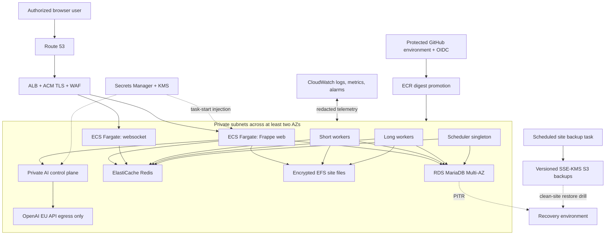

# AWS production reference architecture

- Target: first service-operations pilot
- Region: `eu-central-1`
- Status: plan-only until the ADR-0007 apply gate is approved

## Traffic and trust rules

1. Only ports 443/80 reach the ALB; port 80 redirects to 443 and HSTS is
   enabled after domain validation.
2. Only the ALB security group reaches Frappe web/websocket tasks.
3. Only application security groups reach RDS, Redis, and EFS.
4. The AI control plane is private, receives no ERP database credential, and
   can egress only to approved HTTPS destinations.
5. Administration uses audited AWS control-plane access and ECS Exec only when
   break-glass policy permits it; there are no public SSH hosts.
6. Each tenant hostname maps to exactly one Frappe site/database and backup
   prefix. Provision, restore, and decommission operations must verify that
   mapping before mutation.

## Protected deployment flow

```mermaid
flowchart LR
    PR["Pull request"] --> Gates["Static + contract + service + E2E gates"]
    Gates --> Build["Reproducible image build"]
    Build --> Scan["SBOM + vulnerability + secret scan"]
    Scan --> Digest["Push immutable ECR digest"]
    Digest --> Plan["Plan + typed destructive-change policy + cost review"]
    Plan --> Approve{"Protected foundation approval?"}
    Approve -- "no" --> Stop["No AWS mutation"]
    Approve -- "yes" --> Foundation["Inactive foundation + secret metadata"]
    Foundation --> Secrets["Secrets populated out of band"]
    Secrets --> Activate["Verify secrets + configure + migrate + live AI eval"]
    Activate --> Canary["Activate ECS services by verified digest"]
    Canary --> Verify{"Health, safety, SLO checks pass?"}
    Verify -- "no" --> Rollback["Restore prior task definition digest"]
    Verify -- "yes" --> Promote["Complete rollout and record evidence"]
```

## Failure and recovery rules

- Provider failure returns 503 and does not switch providers silently.
- ECS deployment circuit breakers roll back unhealthy task definitions.
- Scheduler desired count is one; worker services scale from queue age with
  maximums set by database connection capacity.
- Database failure follows RDS Multi-AZ recovery; logical corruption uses PITR
  into a new target and owner-controlled cutover.
- Tenant restore drills use a temporary recovery stack and separate Terraform
  state, then verify roles, tenant isolation, private-file authorization,
  transaction links, AI audit hashes, and checksums before the stack is deleted.
- Backup deletion, customer erasure, and incident evidence follow the approved
  retention schedule; no public issue may contain production evidence.

## Scalability checkpoints

Scale workers on queue age, web tasks on ALB request/latency signals, and AI
tasks on concurrency/error rate. Before raising maximum task counts, confirm
RDS connections, Redis memory, EFS throughput, OpenAI rate limits, and the cost
budget. Multi-region, active-active, shared-row tenancy, and EKS are deliberately
outside this first reference.

## Balanced pilot limits

- USD 600 monthly AWS budget.
- One shared NAT gateway and one encrypted Valkey node; both are documented
  pilot availability tradeoffs and must be revisited after an outage or before
  a production SLA.
- RDS MariaDB stays Multi-AZ with 14-day recovery retention.
- Web and AI start at one task and may scale to two. Websocket and long worker
  remain at one, short workers scale to two, and scheduler stays exactly at one.
- Deployments use circuit-breaker rollback. Missing service tasks, unhealthy
  ALB targets, database storage pressure, and Redis eviction are alarmed.
- Configure, migration, and logical backup task definitions are on-demand only;
  Terraform and CI never start them.
