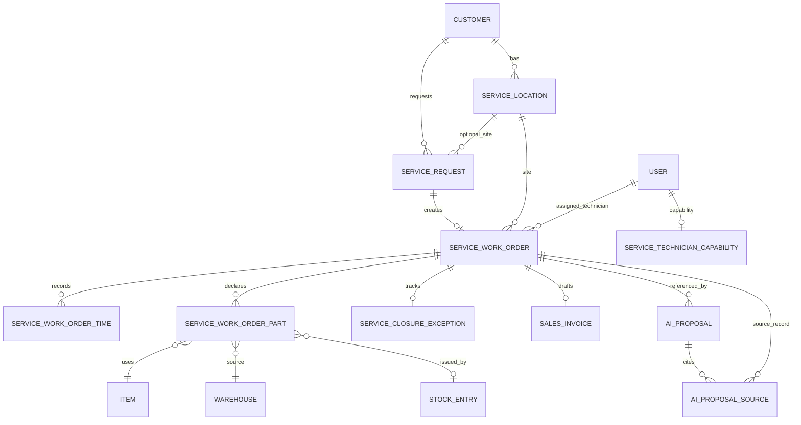

# Domain data model

This document maps the MVP custom DocTypes to ERPNext records. It is a
contributor guide, not a replacement for the DocType JSON files in `apps/`.

## Model overview

ERPNext owns `Customer`, `Contact`, `Address`, `Item`, `Warehouse`,
`Stock Entry`, `Sales Invoice`, `User`, roles, permissions, stock/accounting
ledgers, and audit history. The custom apps add only the service workflow and
AI proposal records that ERPNext does not supply directly.

## Custom DocTypes

| DocType | App | Purpose | Key links |
| --- | --- | --- | --- |
| `AI Proposal` | `ai_erp_core` | Immutable, cited, draft-only AI output and human review state. | Dynamic reference to the source record; child `AI Proposal Source`; requester/reviewer `User`. |
| `AI Proposal Source` | `ai_erp_core` | Child citation row with source record, source field, and content hash. | Dynamic source record, currently service work-order fields. |
| `Service Location` | `ai_erp_service` | Customer service site and optional default stock source. | ERPNext `Customer`, `Address`, `Warehouse`. |
| `Service Request` | `ai_erp_service` | Intake record that can create a linked work order. | ERPNext `Customer`, `Contact`; custom `Service Location`; custom `Service Work Order`. |
| `Service Work Order` | `ai_erp_service` | Central workflow record for scheduling, technician execution, closeout, parts, profitability, invoice readiness, and draft invoice link. | ERPNext `Customer`, `User`, `Item`, `Sales Invoice`; custom `Service Request`, `Service Location`, child time/part rows, closure exception; optional required skill/territory for propose-only scheduling. |
| `Service Technician Capability` | `ai_erp_service` | One active skill/territory profile per technician for deterministic scheduling ranking. | ERPNext `User`. |
| `Service Work Order Time` | `ai_erp_service` | Child row for technician work/travel hours. | ERPNext `User`. |
| `Service Work Order Part` | `ai_erp_service` | Child row for declared parts, bill rate, source warehouse, and issued Stock Entry link. | ERPNext `Item`, `Warehouse`, `Stock Entry`. |
| `Service Closure Exception` | `ai_erp_service` | Owned blocker when a work order cannot close or become invoice-ready. | Custom `Service Work Order`; owner `User`. |

## Transaction-authoritative records

| Business concern | System of record | Custom behavior |
| --- | --- | --- |
| Customer identity and billing party | ERPNext `Customer` and `Contact` | Service records link to these; they do not replace them. |
| Stock movement | ERPNext `Stock Entry` | `issue_parts` creates one submitted Material Issue for unissued part rows, manager-gated and idempotent. |
| Invoice draft | ERPNext `Sales Invoice` | `make_draft_sales_invoice` creates or returns one linked draft invoice, Accounts-role-gated and idempotent. |
| Work execution | `Service Work Order` | Custom workflow validates scheduling, technician scope, closeout, exceptions, invoice readiness, and profitability projection. |
| AI review | `AI Proposal` | AI output is stored as an immutable proposal. Review records an approval/rejection only. |

## Write boundaries

- `Service Request` may create one linked `Service Work Order`.
- `Service Work Order` validates state transitions and blocks invoice readiness
  when required closeout data, issued parts, or exception resolution is missing.
- `Service Work Order Part.stock_entry` can be linked only by the deterministic
  stock-issue action.
- `Service Work Order.sales_invoice` can be linked only by the deterministic
  draft-invoice action.
- After a `Sales Invoice` is linked, billing basis fields and time/part rows are
  immutable.
- `AI Proposal` review cannot update work-order status, closeout text, stock,
  invoices, payroll, roles, permissions, compliance state, or email.

## Fields to treat as sensitive

The demo uses synthetic data only, but real deployments must treat these as
sensitive:

- Customer names, contacts, addresses, and site notes.
- Technician users and work notes.
- Closeout evidence paths and any future attachments.
- Invoice, stock, and profitability fields.
- AI proposal input/output hashes, draft content, prompt/model metadata, and
  citations.

The first AI closeout workflow sends only allow-listed service-work-order fields
to the AI control plane. It does not send attachment contents, customer contact
details, addresses, credentials, or accounting/stock ledger records.

Future external connectors should use the minimal event payloads in
`contracts/events/service-operations-v1.yaml` and fetch any additional ERP data
through an authorized API.

## Extension rule

Before adding a new DocType, confirm whether ERPNext configuration, workflow,
custom fields, or permissions can model the requirement. If a new DocType is
still necessary, update this document, the relevant workflow doc, and the
focused tests in the same change.
