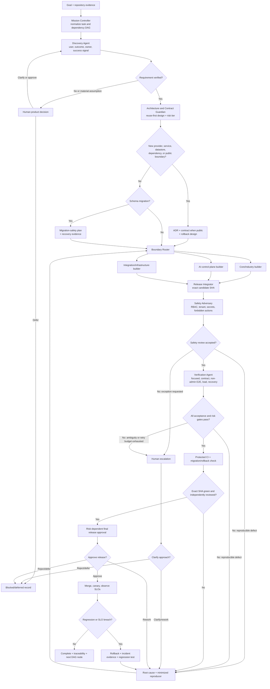

# Multi-agent ERP delivery system

This is a risk-gated delivery workflow for completing the AI ERP roadmap. It
coordinates software work; it is not an ERP business-state automation engine.
Agents may inspect, design, implement, test, and propose releases. They may not
autonomously post financial, stock, payroll, identity, access-control, or
compliance changes.

## Control flow

Only the Mission Controller changes task state. Only the Release Integrator
sequences merges. A worker statement such as “done” is never completion
evidence.

## Agent contracts

| Agent | Inputs | Outputs | Decision logic |
| --- | --- | --- | --- |
| Mission Controller / Backlog Router | Goal, repository state, roadmap, risk policy, CI state | Normalized task envelopes, dependency DAG, owner, budgets, stop conditions | Mark requirements verified, assumed, or deferred. Send material assumptions to a human. Parallelize only independent path sets. |
| Discovery Agent | Task, interview/repository evidence, MVP metrics | Target user, business outcome, process owner, system of record, measurable acceptance | Without a named user, outcome, owner, and success signal, defer or request a human decision. Do not promote hypotheses to build work. |
| Architecture and Contract Guardian | Verified requirement, affected boundaries, current contracts | Reuse-first design, risk tier, roles, approval states, tenant scope, audit events, error/retry behavior, ADR/contract/migration/rollback delta; for AI, allowed tools, prohibited changes, citations, retention, evaluations, cost limit, and abstention | Stop at the first safe option: defer, reuse ERPNext/Frappe, standard library/constraint, native capability, approved dependency, then smallest code. Material architecture changes require an ADR. |
| Boundary Build Pool | Approved design, contract, acceptance tests, isolated branch | Small coherent implementation, focused tests, concise behavior docs | Route cross-industry behavior to `ai_erp_core`, sector behavior to its app, provider/prompt/evaluation work to `ai_control_plane`, and public schemas to `contracts/`. Never patch upstream. |
| Safety Adversary | Candidate diff, authorization matrix, AI registry, threat model | Negative-test results, AI-tool/policy evaluation, severity, accept/reject decision | Test non-admin and cross-user/site behavior, secrets, audit integrity, prohibited AI actions, cost/retention limits, citations, and abstention. Any critical result blocks integration. |
| Verification and Performance Agent | Candidate SHA, task acceptance, risk tier | Exact commands, counts, latency evidence, structured-log/monitoring checks, failures and recovery results | Run focused checks first, then contract/non-admin E2E/recovery checks required by risk. Realistic load is mandatory for list, search, report, inventory, and other load-sensitive changes. Reject evidence from a different SHA or input digest. |
| Release Integrator | Approved candidate and evidence bundle, protected-branch state | Rebased PR, green checks, release/rollback reference | Reject unrelated scope, stale evidence, unresolved conversations, missing sign-off, or non-linear integration. Serialize shared contracts and migrations. |
| Human Product/Security/Business Owner | Ambiguous rules, R3 risks, provider/hosting/cost/retention choices | Approve, clarify, defer, or reject | Humans retain product scope, risk exceptions, production release, and authoritative business-action decisions. |

## Task and evidence structures

Every task uses a `TaskEnvelope` with:

- `task_id`, `parent_goal`, `status`, and dependency IDs;
- requirement evidence (`verified`, `assumed`, or `deferred`) and source;
- boundary class, risk tier, tenant/site scope, base SHA, branch/worktree;
- role permissions, approval states, audit events, error/retry behavior, and
  structured-log/monitoring expectations;
- for AI tasks: allowed tools, prohibited state changes, citation sources,
  context identifiers, retention, evaluation cases, cost limit, and abstention;
- acceptance checks and prohibited changes;
- time, token, cost, concurrency, and retry budgets;
- human decisions and explicit stop conditions.

Every validation produces a versioned `EvidenceBundle` with:

- candidate SHA, changed paths, command/exit-code pairs, and test counts;
- negative security and tenant tests, contract/schema digests, and reviewers;
- performance baseline, percentile method, target, result, and delta;
- model and prompt versions, tool calls, context IDs, output/policy digest,
  approval, and outcome for AI-supported work;
- migration/rollback result, timestamps, and sanitized failure evidence;
- a content digest, producer identity, parent/superseded bundle link, retention,
  and access classification when stored outside the repository.

Reviewer identities, logs, and operational metadata must be sanitized before
any evidence is published in the repository.

A task can enter `COMPLETE` only when every acceptance check links to evidence
for the exact candidate SHA.

## State and risk routing

State progression is:

`INTAKE → DISCOVERY → DESIGNED → BUILDING → SAFETY_REVIEW → VERIFYING →
READY_FOR_INTEGRATION → CI → WAITING_APPROVAL → CANARY → OBSERVING → COMPLETE`.

`WAITING_HUMAN`, `REWORK`, `BLOCKED`, and `ROLLBACK` are explicit states, not
informal comments.

| Tier | Typical work | Required validation |
| --- | --- | --- |
| R0 | Documentation and metadata | Static gates and independent review |
| R1 | Isolated deterministic code | Focused tests, static gates, diff review |
| R2 | Cross-module API, roles, or tenant behavior | R1 plus contracts, non-admin E2E, tenant isolation, adversarial review |
| R3 | Money, stock, payroll, identity, migrations, providers, or sensitive data | R2 plus recovery, performance where relevant, canary, and independent human sign-off |

## Feedback and failure handling

Every failure is returned as candidate SHA, command, expected result, actual
result, sanitized logs, severity, and owning boundary. The builder receives a
minimized reproducer. Tests and approval rules must not be weakened to obtain a
green result.

- Allow at most two automated repair cycles for the same root cause. On the
  third recurrence, an ambiguous business rule, a security exception, migration
  uncertainty, or provider/cost/retention choice, enter `WAITING_HUMAN`.
- Treat flaky tests as failures until their root cause is removed.
- Use bounded retry with jitter, idempotency keys, and a circuit breaker for
  remote adapters. Then abstain and create an observable operator item.
- Block producer/consumer integration on contract mismatch.
- Roll back a failed migration only through the documented, verified recovery
  path. Preserve audit evidence.
- On a canary SLO breach, roll back, open an incident record, add a regression
  test, and route the task to the owning builder.

## Performance qualification

Before expanding agent autonomy, shadow-run 12–20 synthetic gold tasks covering
documentation, permissions, contracts, AI proposals, migrations, integration
retries, and performance regressions. Pin the repository SHA, task-manifest
version, scoring rubric, model configuration, and environment class. A repair
loop is one builder response followed by a complete rerun of the failed gate.
Required thresholds are:

- 100% detection of critical safety, tenant, RBAC, and contract violations;
- 100% acceptance checks and repository gates on the final SHA;
- zero unauthorized business mutations, secrets, upstream patches, or
  unsupported completion claims;
- at least 80% first-pass acceptance and no more than two repair loops per task;
- 100% exact-SHA evidence reproducibility;
- no more than 20% elapsed-time/cost regression from the pinned single-agent
  baseline. Any exception requires a versioned rubric showing a higher number
  of correctly detected seeded defects without a safety regression.

An automated completion-claim check must map every claimed acceptance item to
an exact-SHA evidence entry; an unmapped claim fails qualification.

Start with three R0 tasks, then three reversible R1 tasks, then one R2 feature.
Human review remains mandatory while these thresholds are being established.

## Optimization and scale

- Schedule the dependency-DAG critical path first and cap work in progress.
- Cache immutable dependency, bootstrap, and test artifacts by input digest.
- Run deterministic/static/focused checks before scarce Docker and E2E jobs.
- Batch full cross-service verification at integration boundaries.
- Use strong reasoning models for architecture and security; use cheaper workers
  only for deterministic, bounded transformations with independent checks.
- Give every job an idempotency key, lease, heartbeat, trace ID, budget, and
  retry limit. Apply backpressure instead of spawning unbounded workers.
- Scale builders by bounded context and verification runners horizontally with
  isolated worktrees and Frappe sites. Keep one controller and integrator per
  release train; serialize schema migrations, public contracts, and shared
  configuration.

## Current pending-work run

The first run classified the defined service-operations MVP behavior as
complete and selected one executable R2 evidence gap, task
`PERF-HARNESS-01`: an executable, synthetic, Frappe-native smoke harness with
role isolation, latency thresholds, safe cleanup, and explicit non-claiming
skips for surfaces not yet implemented. Browser E2E and demo media remain
separate executable backlog items. Real provider selection, production
hosting, public release timing, pilot users, and the next industry pack remain
human product decisions. This run is not qualification evidence for autonomous
release until its final evidence bundle passes the thresholds above.
