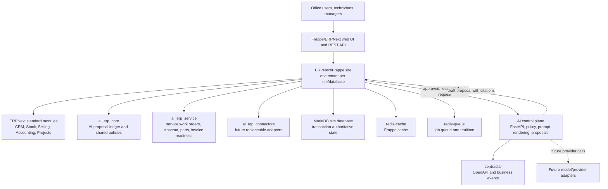
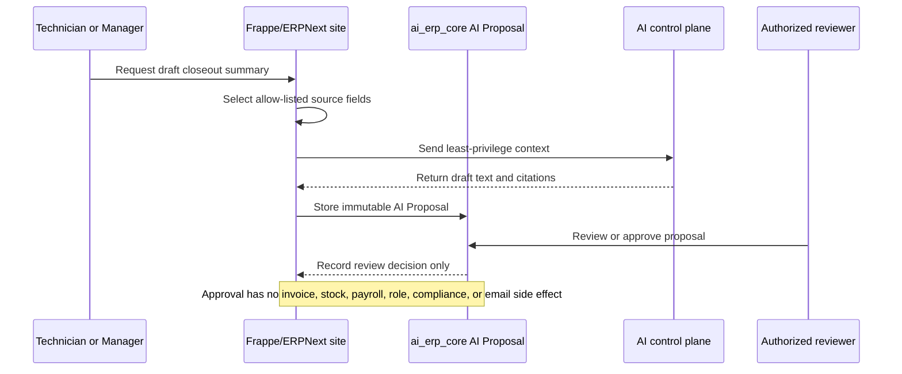
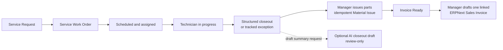

# System boundaries

This document is the first map to read when deciding where new work belongs.
The MVP is a Frappe/ERPNext-based modular monolith with a separately governed
AI control plane. ERPNext remains the transaction system of record.

## Container map

## Write authority

| Area | Owns | May create authoritative ERP transactions? |
| --- | --- | --- |
| ERPNext/Frappe | Customers, items, stock, invoices, accounting, users, roles, workflows, audit history | Yes, through Frappe permissions and deterministic server-side methods |
| `apps/ai_erp_core` | Shared AI governance records and reusable policy helpers | Only for its own audit/proposal records |
| `apps/ai_erp_service` | Service-operation workflow records and manager-triggered ERP handoffs | Yes, but only through explicit role checks, idempotency, and ERPNext documents |
| `services/ai_control_plane` | Prompt rendering, policy metadata, draft proposals, citations, future provider adapters | No. It returns proposals; it does not post money, stock, payroll, access, or compliance changes |
| `contracts/` | Versioned external API and business-event shapes | No |

## AI approval path

## Service workflow path

## Placement rule

- Reuse ERPNext/Frappe configuration before adding code.
- Put cross-industry behavior in `apps/ai_erp_core/`.
- Put first-vertical service behavior in `apps/ai_erp_service/`.
- Put provider calls, prompts, retrieval, and AI evaluations in
  `services/ai_control_plane/`.
- Put public schemas in `contracts/` before or with integration work.
- Put business-event schemas in `contracts/events/`; event payloads notify
  consumers and do not authorize ERP mutations.
- Keep tenant identity at the Frappe site and API edge. Do not add app-level
  shared-row tenant shortcuts for the MVP.
- Write an ADR before introducing a new service, datastore, external provider,
  or irreversible architectural dependency.

If a proposed feature bypasses this map, stop and update the ADRs before code.
