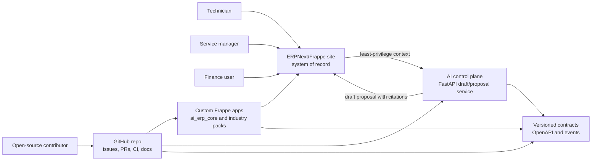
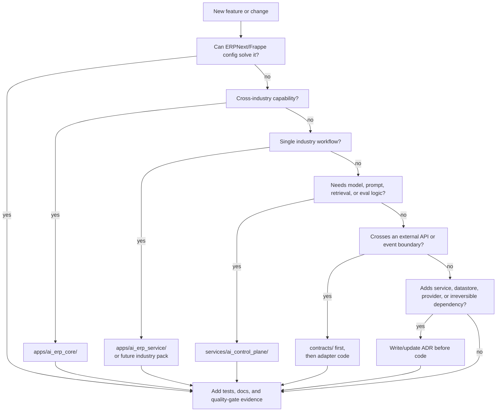

# System context and repository map

This document gives a first-time contributor the shortest safe path through the
AI ERP Demo repository. It complements `system-boundaries.md` by showing both
the runtime product shape and where source changes belong.

## Product context

The ERP site owns authoritative business state. The AI control plane can draft,
summarize, classify, and propose, but it cannot post invoices, stock,
accounting, payroll, permissions, or compliance changes.

## Repository responsibility map

| Path | Responsibility | Do not put here |
| --- | --- | --- |
| `apps/ai_erp_core/` | Cross-industry AI Proposal ledger, approval metadata, shared policy helpers. | Service-specific fields or provider SDK code. |
| `apps/ai_erp_service/` | First vertical workflow: service requests, work orders, closeout, parts, invoice readiness. | Generic AI policy, future industry assumptions, or upstream ERPNext edits. |
| `apps/ai_erp_distribution/` | Reserved future distribution pack after discovery evidence exists. | MVP service-operations logic. |
| `apps/ai_erp_manufacturing/` | Reserved future manufacturing pack after discovery evidence exists. | Service pack shortcuts or unverified production-planning scope. |
| `apps/ai_erp_connectors/` | Replaceable external-system adapters and integration helpers. | Core DocTypes that should live in an industry app. |
| `services/ai_control_plane/` | Prompt rendering, model/provider adapters, retrieval policy, AI tool policy, evals. | Authoritative ERP transactions or tenant credentials. |
| `contracts/openapi/` | Public HTTP API contracts. | Runtime code or non-versioned examples. |
| `contracts/events/` | Business-event schemas. | Event consumers that mutate ERP state without authorization. |
| `docs/adr/` | One decision per material architecture choice. | Long research notes or mutable plans. |
| `docs/discovery/` | Research, scans, interview guides, domain evidence. | Final product promises without validation. |
| `docs/product/` | Scope, roadmap, positioning, industry-pack strategy. | Low-level runtime setup instructions. |
| `docs/security/` | Threat models, data classification, AI workflow review. | Secrets, private prompts, customer samples, or production exports. |
| `docs/runbooks/` | Repeatable operational and publication procedures. | Architecture decisions that need an ADR. |
| `docs/workflows/` | Engineering workflows and quality gates. | One-off status notes. |
| `infra/` | Non-secret infrastructure configuration. | Application business logic. |
| `development/` | Tracked local bootstrap files; generated Frappe Bench state is ignored. | Local credentials in Git or vendored upstream source. |
| `tests/` | Contract, integration, e2e, fixture, and performance tests. | Customer data or production exports. |
| `scripts/` | Safe developer automation with clear output. | Hidden deployment magic or destructive cleanup without explicit flags. |

## Change-routing flow

## First-reader checklist

1. Read this file, then `system-boundaries.md` and `domain-data-model.md`.
2. Check `requirements-traceability.md` before claiming a requirement is done.
3. Use `discovery-design-plan.md` before expanding to another industry pack.
4. Use `security/ai-workflow-review.md` before adding or expanding AI behavior.
5. Run `scripts/run-quality-gates.sh` before proposing publication or a pull
   request.

