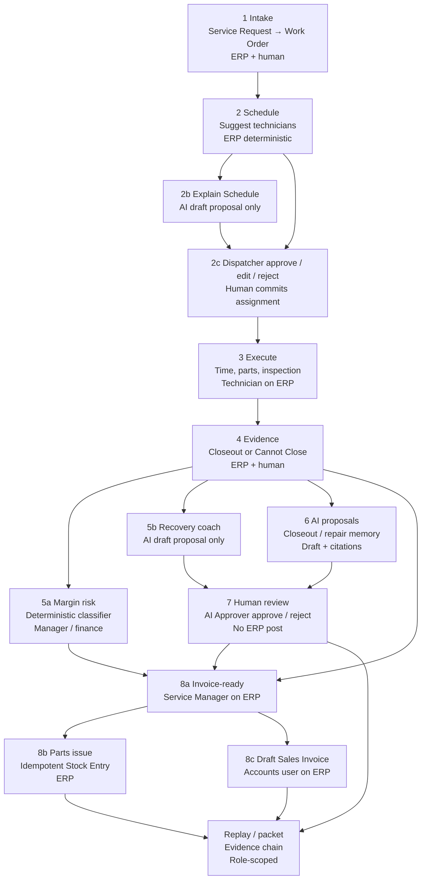

# Demo Version loop

Facilitator-facing map of the **Demo Version** field-service path. This is the
local synthetic product loop, not a production operating model.

Machine label: `config/demo-version.json` (`demo_version`). Stack facts:
[`demo-version-stack.md`](demo-version-stack.md). Session script:
[`design-partner-facilitator.md`](../runbooks/design-partner-facilitator.md).

## Who does what

| Actor | May do | Must not do |
| --- | --- | --- |
| Deterministic ERP / Frappe | Create and post Stock Entry, draft Sales Invoice, assignment, invoice-ready transition | Invent margin or AI text |
| Authorized human | Approve proposals, assign technicians, mark invoice-ready, create draft invoice | Treat AI approval as an ERP post |
| AI control plane | Draft cited proposals (closeout, scheduling explanation, recovery, repair memory) | Post accounting, stock, payroll, permissions, compliance, or customer messages |

## End-to-end graph

Solid ERP/human commit nodes: intake, schedule scoring, assignment, execute,
evidence, margin classification, invoice-ready, stock, draft invoice, replay.

Dashed AI proposal nodes (draft only): Explain Schedule, recovery coach,
closeout / repair-memory proposals. Human approval does not post ERP state.

## Facilitator beats (short)

1. **Intake** — Service Request creates a linked Service Work Order.
2. **Schedule** — Suggest Technicians (deterministic). Optional Explain Schedule
   AI draft. Dispatcher commits assignment.
3. **Execute** — Technician records time, parts, inspection on assigned work.
4. **Evidence** — Closeout fields or Cannot Close exception with owner.
5. **Margin / recovery** — Manager sees deterministic margin risk. Optional
   recovery AI draft for exceptions.
6. **Proposal** — Request closeout or repair-memory AI draft; citations required.
7. **Approval** — AI Approver reviews; approve/reject leaves stock and invoices
   unchanged.
8. **ERP post** — Manager marks invoice-ready; Accounts drafts one Sales
   Invoice; parts issue is one idempotent Stock Entry. Replay/packet for audit.

## Demo claim for the room

Private zero-cost local synthetic service-operations **Demo Version** with
draft-only AI proposals. Do not claim production readiness, human UAT, GDPR
compliance, live-model quality, or a shipped 9/10 product.
